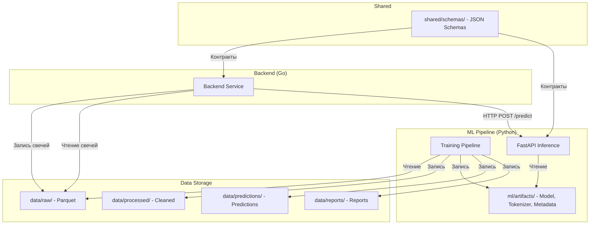
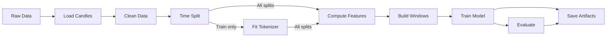
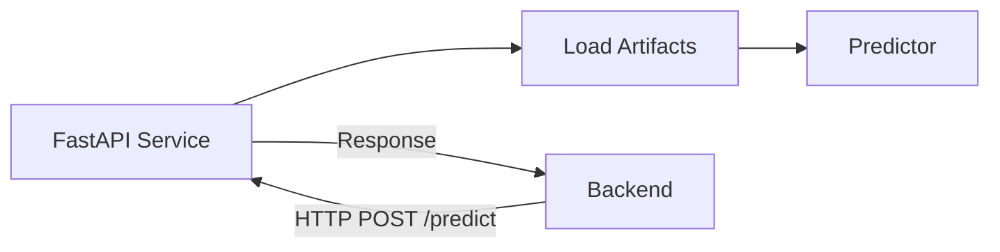
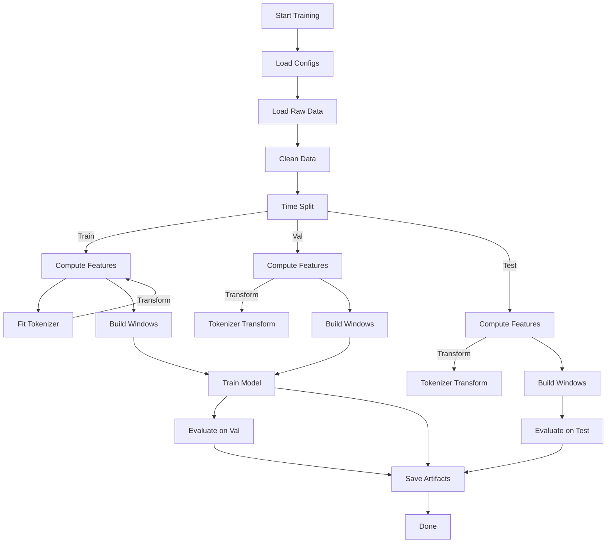
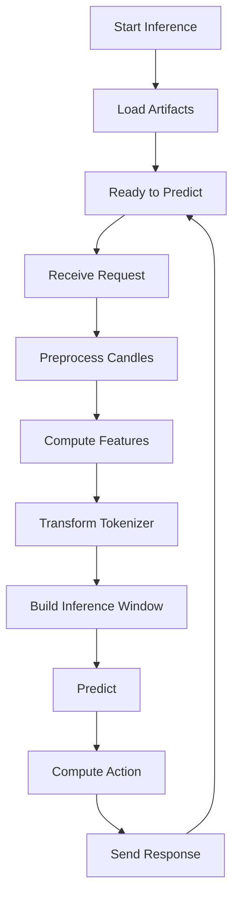

# Архитектура проекта MOEX Candle Predictor

## Цель проекта

Проект предсказывает будущие движения цен свечей на бирже MOEX через подход "свечи как токены". Основная идея — представить последовательность свечей как последовательность токенов и предсказать следующий токен в последовательности (аналогично языковым моделям).

**MVP фокус:**
- Ticker: SBER
- Timeframe: 1H
- Target: класс движения через h=3 свечи вперёд
- Тип задачи: multiclass token classification, K=7 классов
- Основной ML baseline: LightGBM (CPU-optimized)

## Идея "Candles → Tokens → Next Token Prediction"

1. **Свечи → Признаки**: Исторические OHLCV свечи преобразуются в технические индикаторы (returns, ATR, volatility, EMA, candle features, time features).
2. **Признаки → Токены**: Нормализованный возврат (return_h / ATR) квантуется в K=7 бинов через quantile binning.
3. **Токены → Окна**: Из последовательности токенов строятся скользящие окна длиной L=32.
4. **Окна → Предсказание**: Модель предсказывает токен на горизонте h=3 (через 3 свечи вперёд).
5. **Токен → Action**: Предсказанный токен конвертируется в торговое действие (buy/sell/hold).

## Высокоуровневая архитектура



## Роли компонентов

### Backend (Go)
- Получает свечи от внешних источников (MOEX API, брокеры)
- Записывает сырые свечи в `data/raw/` (Parquet format)
- Вызывает ML inference через HTTP для получения предсказаний
- Использует предсказания для генерации торговых сигналов

### ML Pipeline (Python)
- **Training Pipeline**: Загружает raw data, чистит, разделяет, считает признаки, обучает модель, сохраняет артефакты
- **Inference Service**: FastAPI сервис, загружает артефакты, делает предсказания по HTTP

### Data Storage
- **data/raw/**: Сырые свечи в Parquet (источник истины)
- **data/processed/**: Очищенные данные (опционально)
- **data/predictions/**: Предсказания для online evaluation
- **data/reports/**: Отчёты по бэктестам и метрикам

### Artifacts
- **ml/artifacts/**: Сохранённые модели, tokenizer, metadata (вывод обучения)

### Shared
- **shared/schemas/**: JSON схемы для контрактов между backend и ML service

## Структура папок

```
moex-candle-predictor/
├── backend/              # Go backend (внешний к ML части)
├── data/                 # Хранилище данных
│   ├── raw/             # Сырые свечи (Parquet)
│   ├── processed/       # Очищенные данные
│   ├── predictions/     # Предсказания (online)
│   └── reports/        # Отчёты (backtest, metrics)
├── ml/                  # ML implementation
│   ├── configs/         # Конфигурации YAML
│   │   ├── data.yaml
│   │   ├── features.yaml
│   │   ├── train.yaml
│   │   └── eval.yaml
│   ├── src/            # Исходный код ML
│   │   ├── data/       # Загрузка, чистка, split
│   │   ├── features/   # Признаки, токенизация, окна
│   │   ├── models/     # Модели, training pipeline
│   │   ├── evaluation/ # Метрики, backtest, online
│   │   ├── service/    # FastAPI inference
│   │   └── utils/      # I/O, config
│   ├── artifacts/      # Сохранённые артефакты
│   │   ├── model.pkl
│   │   ├── tokenizer.pkl
│   │   └── metadata.json
│   ├── requirements.txt
│   └── README.md
├── shared/              # Общие схемы
│   └── schemas/        # JSON schemas
│       ├── candles_request.json
│       └── prediction_response.json
└── docs/               # Документация
    ├── architecture.md
    ├── api_contract.md
    └── experiments.md
```

## Data Flow End-to-End

### 1. Backend → Data Storage
Backend получает свечи от внешних источников и записывает их в `data/raw/` в формате Parquet.

```bash
# Пример: backend пишет свечи
data/raw/SBER_1H_2024-01.parquet
```

### 2. Training Pipeline


**Шаги:**
1. `ml/src/data/load.py` — Загружает свечи из `data/raw/`
2. `ml/src/data/clean.py` — Валидирует OHLCV, сортирует по времени, удаляет дубликаты
3. `ml/src/data/split.py` — Time-based split (70/15/15) с проверкой утечки
4. `ml/src/features/indicators.py` — Считает технические индикаторы (returns, ATR, volatility, EMA, candle features, time features)
5. `ml/src/features/tokenizer.py` — **Fit только на train**: квантильная бинизация нормализованных возвратов (K=7)
6. `ml/src/features/windows.py` — Строит скользящие окна (L=32) с target на горизонте h=3
7. `ml/src/models/train.py` — Обучает модель (LightGBM по умолчанию)
8. `ml/src/evaluation/metrics.py` — Считает classification metrics (accuracy, F1, log-loss, confusion matrix)
9. `ml/src/evaluation/backtest.py` — Бэктест с trading metrics (Sharpe, MDD, PnL)
10. Сохраняет артефакты в `ml/artifacts/` и отчёты в `data/reports/`

### 3. Inference через FastAPI


**Шаги:**
1. Backend отправляет HTTP POST запрос с последними свечами на `http://localhost:8001/predict`
2. `ml/src/service/api.py` — FastAPI эндпоинт
3. `ml/src/service/predictor.py` — Загружает артефакты, делает preprocessing, предсказывает
4. Возвращает предсказание (token, probabilities, action)

### 4. Backend использует предсказание
Backend получает предсказание и использует его для генерации торговых сигналов.

## Связи между модулями ML

### ml/src/data
- **load.py**: Загрузка свечей из Parquet/CSV
- **clean.py**: Валидация и чистка данных (OHLCV, сортировка, дубликаты)
- **split.py**: Time-based split с проверкой утечки (train < val < test по времени)

### ml/src/features
- **indicators.py**: Технические индикаторы (returns, ATR, volatility, EMA, candle features, time features)
- **tokenizer.py**: Квантильная токенизация (fit на train, transform на val/test/inference)
- **windows.py**: Построение скользящих окон (L=32) с target на горизонте h=3

### ml/src/models
- **baseline.py**: Baseline модели (MajorityClassifier, MarkovClassifier, LogisticRegressionBaseline)
- **lgbm_model.py**: LightGBM классификатор (основной MVP)
- **rnn_model.py**: RNN stub (будущая реализация)
- **train.py**: Training pipeline orchestrator (загрузка конфигов, запуск всего pipeline)

### ml/src/evaluation
- **metrics.py**: Classification metrics (accuracy, F1, precision, recall, log-loss, confusion matrix)
- **backtest.py**: Backtesting с trading metrics (Sharpe, MDD, PnL, win rate)
- **online_eval.py**: Online evaluation для live предсказаний

### ml/src/service
- **schemas.py**: Pydantic схемы для API (Candle, PredictRequest, PredictResponse)
- **predictor.py**: Prediction класс с preprocessing (загрузка артефактов, предсказание)
- **api.py**: FastAPI сервис (GET /health, POST /predict)

### ml/src/utils
- **io.py**: I/O функции (read/write Parquet, CSV, JSON, pickle)
- **config.py**: Загрузка YAML конфигов

## Ответственность файлов

### Конфигурация
- `ml/configs/data.yaml`: Путь к raw data, tickers, timeframes, split ratios
- `ml/configs/features.yaml`: K=7, h=3, L=32, параметры индикаторов
- `ml/configs/train.yaml`: Model type, LightGBM hyperparameters, paths
- `ml/configs/eval.yaml`: Evaluation settings

### Data
- `ml/src/data/load.py`: `load_candles()` — загрузка из Parquet/CSV
- `ml/src/data/clean.py`: `clean_candles()` — валидация и чистка
- `ml/src/data/split.py`: `time_split()` — time-based split с проверкой утечки

### Features
- `ml/src/features/indicators.py`: `compute_all_indicators()` — все технические индикаторы
- `ml/src/features/tokenizer.py`: `CandleTokenizer` — квантильная токенизация
- `ml/src/features/windows.py`: `build_tabular_windows()`, `build_inference_window()` — окна

### Models
- `ml/src/models/baseline.py`: Baseline модели
- `ml/src/models/lgbm_model.py`: `LGBMClassifier` — основной MVP
- `ml/src/models/train.py**: `train_pipeline()` — orchestrator

### Evaluation
- `ml/src/evaluation/metrics.py`: `compute_classification_metrics()` — метрики
- `ml/src/evaluation/backtest.py**: `backtest_strategy()` — бэктест
- `ml/src/evaluation/online_eval.py`: `save_prediction()`, `evaluate_online_predictions()` — online

### Service
- `ml/src/service/schemas.py`: Pydantic схемы
- `ml/src/service/predictor.py`: `CandlePredictor` — inference
- `ml/src/service/api.py`: FastAPI приложение

## Риски утечки данных (Leakage)

### 1. Tokenizer Fit
**Риск:** Tokenizer fit на val/test может использовать информацию о будущем.
**Решение:** `CandleTokenizer.fit()` вызывается только на train данных. Val/test и inference используют `transform()` с уже обученным tokenizer.

```python
# В train.py
train_features, train_tokens, tokenizer = compute_features_and_tokens(
    train_df, features_config, tokenizer=None  # Fit только на train
)
val_features, val_tokens, _ = compute_features_and_tokens(
    val_df, features_config, tokenizer=tokenizer  # Transform
)
```

### 2. Rolling Features
**Риск:** Rolling индикаторы могут использовать будущие данные.
**Решение:** Все rolling окна в `indicators.py` используют только исторические данные (pandas rolling functions по умолчанию).

```python
# Пример: ATR использует только past data
df["atr"] = df["tr"].rolling(window=period).mean()
```

### 3. Target Construction
**Риск:** Target может использовать текущую свечу вместо будущей.
**Решение:** Target строится через `shift(-horizon)` в tokenizer, окна строятся так, что target всегда в будущем.

```python
# В tokenizer.py
future_close = df["close"].shift(-self.horizon)  # h=3 свечи вперёд
```

### 4. Time Split
**Риск:** Случайный split может привести к утечки времени.
**Решение:** `time_split()` использует хронологический split и валидирует, что max(train_time) < min(val_time) < min(test_time).

```python
# В split.py
if train_df["begin"].max() >= val_df["begin"].min():
    raise ValueError("Time leakage detected: train >= val")
```

## Train/Serve Consistency

**Принцип:** Inference использует тот же код preprocessing, что и training.

### 1. Feature Engineering
- Training: `compute_all_indicators(df)` в train.py
- Inference: `compute_all_indicators(df)` в predictor.py
- **Тот же код**, те же параметры из конфига

### 2. Tokenization
- Training: Fit на train, transform на val/test
- Inference: Transform с загруженным tokenizer (bin edges сохранены)
- **Те же bin edges**, те же параметры (K, horizon)

### 3. Window Building
- Training: `build_tabular_windows()` для обучения
- Inference: `build_inference_window()` для single prediction
- **Та же логика**, тот же window_size L

### 4. Model
- Training: `LGBMClassifier.fit()` с early stopping
- Inference: `LGBMClassifier.load()` и `predict()`
- **Та же модель**, те же гиперпараметры

## Решения для MVP и обоснование

### 1. Parquet Raw Format
**Почему:** Эффективный columnar format, поддерживает типы данных, быстрое чтение, совместимость с pandas.
**Альтернативы:** CSV (медленно, типы), HDF5 (сложнее).

### 2. Quantile Tokenizer on Train Only
**Почему:** Robust к выбросам, адаптивный к распределению данных, предотвращает leakage.
**Альтернативы:** Fixed bins (не адаптивно), equal-width (чувствительно к выбросам).

### 3. LightGBM as Main Model
**Почему:** CPU-optimized, быстрое обучение, хорошая accuracy на табличных данных, встроенная обработка пропусков, balanced class weights.
**Альтернативы:** XGBoost (аналогично), CatBoost (дольше), Neural Networks (GPU required, сложнее).

### 4. FastAPI as Inference Layer
**Почему:** Современный async framework, automatic validation через Pydantic, хорошая документация, лёгкий деплой.
**Альтернативы:** Flask (синхронный), gRPC (сложнее), REST over plain HTTP (без валидации).

### 5. CPU-First Design
**Почему:** Проще деплой, дешевле инфраструктура, MVP не требует GPU, LightGBM оптимизирован для CPU.
**Альтернативы:** GPU (дороже, сложнее).

## Как читать код по порядку

Для нового разработчика рекомендуется следующий маршрут:

### 1. Конфигурации
Начните с понимания параметров:
- `ml/configs/data.yaml` — откуда брать данные, как разбивать
- `ml/configs/features.yaml` — как считать признаки, токенизировать
- `ml/configs/train.yaml` — какую модель обучать
- `ml/configs/eval.yaml` — как оценивать

### 2. Data Layer
Поймите, как данные попадают в pipeline:
- `ml/src/data/load.py` — загрузка из Parquet
- `ml/src/data/clean.py` — валидация и чистка
- `ml/src/data/split.py` — time-based split

### 3. Feature Engineering
Поймите, как строятся признаки и токены:
- `ml/src/features/indicators.py` — технические индикаторы
- `ml/src/features/tokenizer.py` — токенизация (fit на train, transform на остальных)
- `ml/src/features/windows.py` — построение окон

### 4. Models & Training
Поймите, как обучается модель:
- `ml/src/models/baseline.py` — простые baseline'ы
- `ml/src/models/lgbm_model.py` — основной MVP (LightGBM)
- `ml/src/models/train.py` — orchestrator всего pipeline

### 5. Evaluation
Поймите, как оценивается модель:
- `ml/src/evaluation/metrics.py` — classification metrics
- `ml/src/evaluation/backtest.py` — trading metrics

### 6. Service
Поймите, как работает inference:
- `ml/src/service/schemas.py` — Pydantic схемы запроса/ответа
- `ml/src/service/predictor.py` — prediction класс
- `ml/src/service/api.py` — FastAPI сервис

## Схема Training Flow



## Схема Inference Flow


