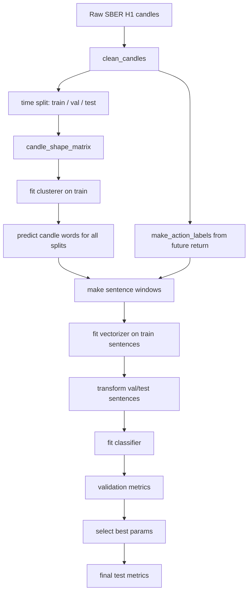
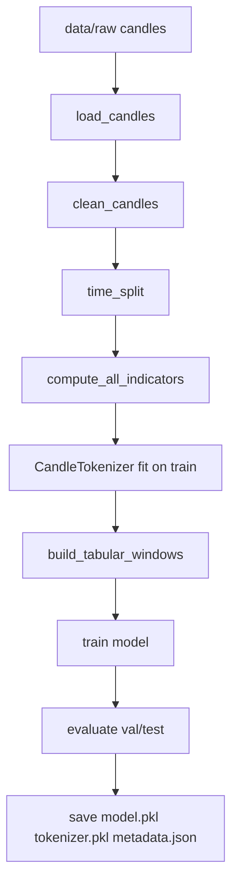
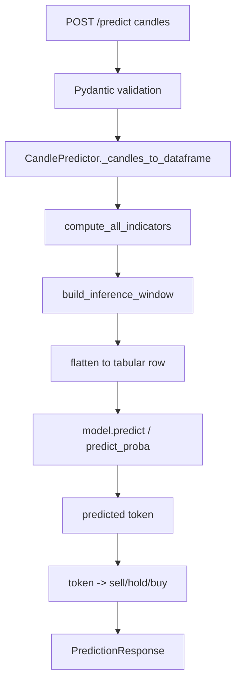
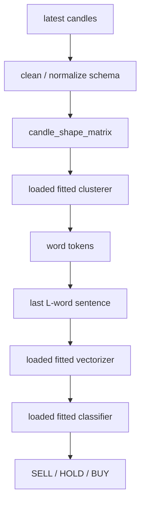

# ML Module Architecture

## Назначение

`ml/` отвечает за Python-часть проекта:

- загрузка и очистка свечей из `data/raw`;
- построение признаков или candle-language представления;
- обучение и сравнение моделей;
- сохранение артефактов;
- HTTP inference через FastAPI.

Сейчас внутри `ml/` есть два слоя:

1. Legacy production inference: текущий `POST /predict` использует сохраненные `ml/artifacts/model.pkl`, `tokenizer.pkl`, `metadata.json` и табличные признаки.
2. Candle-language research pipeline: новая логика из статей, где свеча становится словом, окно свечей становится предложением, а модель предсказывает `SELL/HOLD/BUY`.

Новая candle-language логика уже вынесена в код и исследовательский CLI, но еще не подключена как основной HTTP inference artifact. Это важная граница текущей архитектуры.

## Структура Файлов

```text
ml/
├── artifacts/
│   ├── model.pkl
│   ├── tokenizer.pkl
│   └── metadata.json
├── configs/
│   ├── data.yaml
│   ├── eval.yaml
│   ├── features.yaml
│   ├── nlp_research.yaml
│   └── train.yaml
├── scripts/
│   ├── sber_hourly_research.py
│   └── sber_nlp_research.py
├── src/
│   ├── data/
│   ├── evaluation/
│   ├── features/
│   ├── models/
│   ├── nlp/
│   ├── service/
│   └── utils/
├── requirements.txt
└── test_smoke.py
```

## Основные Пакеты

### `src/data`

Работает с raw candles.

- `load.py`: читает parquet/csv, объединяет файлы из директории, нормализует имена колонок.
- `clean.py`: приводит timestamp, сортирует свечи, удаляет дубликаты и некорректные OHLCV.
- `split.py`: делает time-based train/validation/test split и walk-forward split.
- `fixtures.py`: генерирует mock-свечи для smoke-тестов.

Ожидаемый raw candle contract:

```text
ticker, timeframe, begin, end, open, high, low, close, volume, value, source
```

### `src/features`

Legacy feature layer для текущего HTTP inference.

- `indicators.py`: returns, ATR, volatility, volume ratio, EMA, candle/time features.
- `tokenizer.py`: `CandleTokenizer`, который превращает будущий ATR-normalized return в квантильный token.
- `windows.py`: строит tabular/sequence окна для обучения и последнее inference-окно.

Этот слой полезен для старого бейзлайна, но не полностью соответствует candle-language идее из статей, потому что token здесь связан с будущей доходностью.

### `src/models`

Legacy модели и training CLI.

- `train.py`: полный train pipeline по `ml/configs/*.yaml`.
- `baseline.py`: `MajorityClassifier`, `MarkovClassifier`, `LogisticRegressionBaseline`.
- `lgbm_model.py`: wrapper над LightGBM.
- `rnn_model.py`: заготовка под RNN-путь.

`train.py` сохраняет artifacts в `ml/artifacts/`.

### `src/nlp`

Новый candle-language слой под нашу текущую исследовательскую логику.

- `candles.py`: строит форму свечи, labels `SELL/HOLD/BUY`, sentence windows.
- `clustering.py`: превращает форму свечи в candle word.
- `vectorizers.py`: превращает последовательность candle words в численный вектор.
- `classifiers.py`: фабрика классификаторов.
- `pipeline.py`: единый эксперимент от raw dataframe до метрик.

Идея слоя:

```text
OHLC candle
  -> normalize by open
  -> candle shape vector
  -> cluster id
  -> word token, e.g. w007
  -> rolling sentence of recent words
  -> sentence vector
  -> classifier
  -> SELL / HOLD / BUY
```

### `src/service`

HTTP inference service.

- `api.py`: FastAPI app, `/health`, `/predict`.
- `predictor.py`: `CandlePredictor`, загрузка artifacts и preprocessing для текущего production inference.
- `schemas.py`: Pydantic-схемы request/response.

Важно: `service/predictor.py` сейчас использует legacy artifact format. Он не загружает `src/nlp` pipeline как production-модель.

### `src/evaluation`

Метрики и вспомогательные проверки.

- `metrics.py`: classification metrics, simple trading metrics.
- `backtest.py`: backtest helpers.
- `online_eval.py`: сохранение и оценка online predictions.

### `src/utils`

Общие утилиты.

- `config.py`: загрузка YAML-конфигов.
- `io.py`: read/write parquet/csv/json/pickle/joblib.

## Candle-Language Процесс

Новая логика следует статье “language of candlesticks”:

1. Берем очищенные свечи.
2. Нормализуем форму каждой свечи относительно `open`.
3. Кластеризуем формы свечей только на train split.
4. Каждой свече присваиваем word token.
5. Строим rolling window из последних `L` word tokens.
6. Размечаем target:
   - `BUY`, если future return выше `2 * commission`;
   - `SELL`, если future return ниже `-2 * commission`;
   - `HOLD` иначе.
7. Векторизуем sentence window.
8. Обучаем классификатор.
9. Выбираем параметры по validation macro-F1.
10. Test используем только для финальной оценки.

Mermaid-схема процесса:



## Кластеризация Свечей

Файл: `ml/src/nlp/clustering.py`.

Поддержанные методы:

- `kmeans`: основной paper-like вариант; можно менять `n_clusters`, `init`, `n_init`.
- `minibatch_kmeans`: более быстрый KMeans для больших сеток.
- `agglomerative`: иерархическая кластеризация; для val/test используется nearest-centroid assignment.
- `gmm`: Gaussian Mixture; на исследовании SBER H1 дал лучший validation result.
- `dbscan`: плотностная кластеризация; может давать noise.
- `hdbscan`: sklearn HDBSCAN; также может давать noise.

Для методов без native `predict` модуль считает центроиды train-кластеров и назначает новые свечи к ближайшему центроиду. Это позволяет честно применять модель к validation/test без повторного fit на будущих данных.

## Векторизация Предложений

Файл: `ml/src/nlp/vectorizers.py`.

Поддержанные варианты:

- `tfidf`: sparse TF-IDF по word n-grams.
- `tfidf_svd`: TF-IDF + `TruncatedSVD`, то есть компактное latent semantic представление.
- `cooccurrence_svd`: Word2Vec-подобная детерминированная схема:
  - строится word-word cooccurrence matrix;
  - применяется PPMI;
  - применяется SVD;
  - embeddings агрегируются по окну через `mean`, `std`, `last`, `max`, `sum`;
  - optionally добавляется histogram слов.

`cooccurrence_svd` выбран как устойчивый локальный аналог distributional embeddings без зависимости от внешнего обучения Word2Vec.

## Классификация

Файл: `ml/src/nlp/classifiers.py`.

Поддержанные классификаторы:

- `ridge`
- `linear_svc`
- `svc_rbf`
- `random_forest`
- `extra_trees`
- `hist_gb`
- `lightgbm`
- `logreg`
- `mlp`

В исследовательском запуске использовались в основном `Ridge`, `LinearSVC`, `LightGBM`, `ExtraTrees`. Это сделано, чтобы проверить альтернативы softmax/logistic-классификации из статьи.

## Research CLI

Файл: `ml/scripts/sber_nlp_research.py`.

Основной запуск:

```powershell
python ml\scripts\sber_nlp_research.py --quick --limit 72 --output-json data/reports/sber_h1_nlp_research_20260504.json --output-csv data/reports/sber_h1_nlp_research_20260504.csv
```

Что делает скрипт:

1. Находит последний `SBER_1H_*.parquet` в `data/raw`.
2. Если данных нет или передан `--refresh-data`, скачивает свечи через MOEX ISS helper.
3. Очищает свечи.
4. Строит сетку `ExperimentConfig`.
5. Для каждой конфигурации запускает `run_experiment`.
6. Пишет подробный JSON и табличный CSV в `data/reports`.
7. Печатает лучшую конфигурацию по validation macro-F1.

`--limit` выбирает равномерную детерминированную подвыборку по всей сетке. Без `--limit` можно запустить полный перебор.

## Legacy Train Process

Файл: `ml/src/models/train.py`.

Текущий production train process:



Этот процесс сохраняет artifacts, которые потом читает HTTP service.

## Legacy Prediction Process

Файлы:

- `ml/src/service/api.py`
- `ml/src/service/predictor.py`
- `ml/src/service/schemas.py`

Текущий `/predict` работает так:



Детали:

- predictor загружает `metadata.json`, `model.pkl`, `tokenizer.pkl`;
- минимальная длина входа берется из `metadata["L"]`;
- порядок feature columns берется из `metadata["feature_set"]`, если он сохранен;
- `MarkovClassifier` artifacts явно не поддержаны HTTP inference path;
- action считается относительно середины token-классов:
  - token ниже середины -> `sell`;
  - token равен середине -> `hold`;
  - token выше середины -> `buy`.

## Candle-Language Prediction Process

Целевой процесс для новой логики будет другим:



Чтобы сделать этот процесс production-ready, нужно сохранить одним artifact bundle:

- fitted clusterer;
- fitted vectorizer;
- fitted classifier;
- metadata: `shape_variant`, `horizon`, `window_size`, `commission`, label map, training data range;
- optional calibration/risk thresholds.

После этого `CandlePredictor` можно расширить веткой `model_family == "candle_language"` и поддержать новый artifact format без ломки legacy-модели.

## Конфиги

Legacy:

- `data.yaml`: пути к raw data, тикер, timeframe, split.
- `features.yaml`: `num_classes`, `horizon`, `window_size`, feature settings.
- `train.yaml`: тип модели и параметры обучения.
- `eval.yaml`: настройки оценки.

Candle-language:

- `nlp_research.yaml`: документирует сетку методов и критерий selection.

Фактическая сетка сейчас задается в `sber_nlp_research.py`, потому что часть параметров является Python-объектами, например `ngram_range` и tuples для `MLP`.

## Артефакты

Production artifacts:

```text
ml/artifacts/model.pkl
ml/artifacts/tokenizer.pkl
ml/artifacts/metadata.json
```

Research artifacts:

```text
data/reports/sber_h1_nlp_research_*.json
data/reports/sber_h1_nlp_research_*.csv
docs/sber_h1_nlp_research_2026-05-04.md
```

`data/reports/*.json` и `*.csv` игнорируются git, потому что они воспроизводимы и могут быть большими. Итоговые выводы фиксируются в `docs/`.

## Проверки

Базовая проверка:

```powershell
python ml\test_smoke.py
```

Что проверяет:

- импорты `src.data`, `src.features`, `src.models`, `src.evaluation`, `src.nlp`, `src.service`;
- загрузку конфигов;
- mock legacy feature/tokenizer pipeline;
- mock candle-language pipeline.

Синтаксическая проверка:

```powershell
python -m compileall -q ml\src ml\scripts\sber_nlp_research.py
```

## Текущие Ограничения

- Новый candle-language pipeline пока не сохраняет production artifact bundle.
- HTTP `/predict` пока не использует `src/nlp`.
- Research selection оптимизирует classification macro-F1, а не торговую доходность.
- Simple trading backtest в отчете отрицательный после комиссии, поэтому сигнал нельзя считать готовой стратегией.
- Для production нужна walk-forward проверка, calibration, risk layer и отдельный критерий отбора торгового сигнала.
